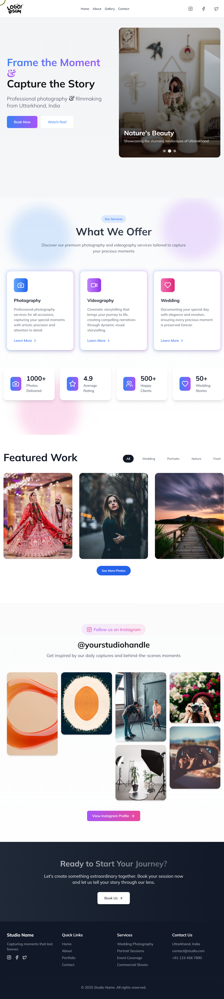

# 📸 Modern Photography Studio Landing Page

<div align="center">
  
  <p><em>Project Implementation Reference</em></p>
</div>

## ✨ Overview

A stunning, responsive photography studio landing page featuring modern design elements, smooth animations, and an elegant user interface. This project demonstrates the implementation of complex layouts and responsive design principles using pure HTML and CSS.

## 🎯 Live Demo

[View Live Project](https://github.com/TheDany369/Web-d-fast-Taiga)

## ⚡ Key Features

- **Elegant Hero Section**
  - Dynamic split layout
  - Engaging typography
  - Call-to-action buttons with hover effects

- **Professional Services Showcase**
  - Interactive service cards
  - Transform animations on hover
  - Clean grid layout

- **Stunning Gallery**
  - Responsive image grid
  - Smooth scaling transitions
  - Professional portfolio display

- **Statistics & Achievements**
  - Clean number displays
  - Engaging icon integration
  - Grid-based layout

- **Modern Contact Section**
  - Professional form layout
  - Social media integration
  - Location information

## 💻 Technical Features

### Responsive Design
- **Desktop-First Approach**
- **Mobile-Friendly Layout**
- **Cross-Browser Compatibility**
- **Flexible Component Design**

### CSS Implementation
```css
/* Key styling features */
* {
  margin: 0%;
  padding: 0%;
  box-sizing: border-box;
  font-family: Arial, Helvetica, sans-serif;
  scroll-behavior: smooth;
}

Copy

Insert at cursor
markdown
Design Elements
Clean typography using system fonts

Consistent spacing and alignment

Professional color scheme

Interactive hover states

Smooth transitions

🛠️ Built With
HTML5 - Semantic markup

CSS3 - Modern styling features

Flexbox

CSS Grid

Transitions

Transforms

RemixIcon - Icon library

📱 Responsive Breakpoints
Desktop (> 768px)

Mobile (≤ 768px)

🚀 Quick Start
Clone the repository

git clone https://github.com/TheDany369/Web-d-fast-Taiga

Copy

Insert at cursor
bash
Navigate to project directory

cd Web-d-fast-Taiga

Copy

Insert at cursor
bash
Open in browser

Double click index.html or use Live Server extension in VS Code

📂 Project Structure
photography-studio/
│
├── index.html         # Main HTML structure
├── style.css          # Styling and animations
├── target.png         # Reference design
├── assets/            # Project assets
│   └── images/        # Image resources
└── README.md          # Project documentation

Copy

Insert at cursor
text
🔮 Future Enhancements
Image gallery filtering

Lightbox functionality

Contact form integration

Dark mode toggle

Image lazy loading

Animation optimizations

👤 Author
Himanshu Dhaila

GitHub Profile:
https://github.com/TheDany369/

LinkedIn Profile:
https://in.linkedin.com/in/himanshu-dhaila-97717326b 

🌟 Acknowledgments
Part of Web-d-fast-Taiga project collection

Inspiration from TBI GEU || BHIMTAL

RemixIcon for the icon library

System fonts for clean typography

📝 License
This project is open source and available under the MIT License.

<div align="center">
<p>⭐ Star this repository if you find it helpful!</p>
<p>Created with ❤️ by Himanshu Dhaila</p>
</div>


This README.md:
1. Starts with a visual impact using the target image
2. Highlights both technical and design aspects
3. Provides clear documentation and structure
4. Includes all your professional links
5. Maintains transparency while showcasing your skills
6. Uses emojis and formatting for better readability
7. Includes comprehensive sections for future contributors